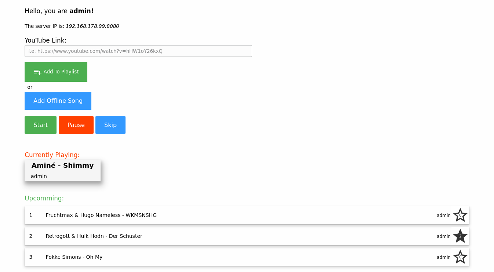
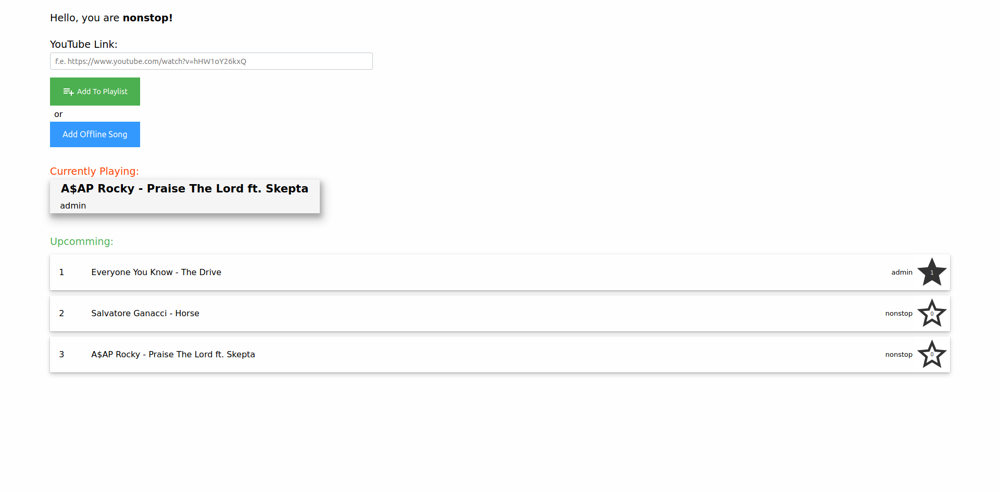
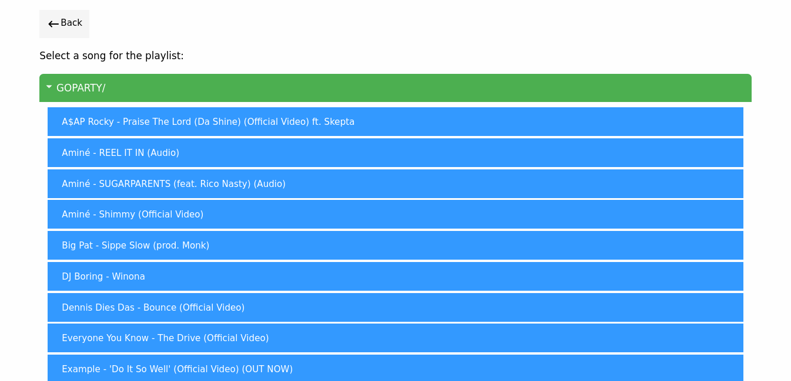

# goparty - the YouTube music queue software

## What is this?

This is a program for handling music at parties or just with some friends.
It allows downloading songs from YouTube and playing them in an evenly distributed song queue.
All downloaded songs get saved as mp3 files. When trying to download the same song again, the program recognizes this and just queues the already downloaded song.
Also it is possible to see all mp3 files in a directory, so f.e. you can provide some of your favorite albums in a directory the program respects and then loads also these offline songs in.
All this works by creating a webserver on the admin machine and all smartphones/ laptops capable of using a webbrowser can access the song queue.
It is also possible for users to vote their favorite songs up, then they get reranked in the song queue.

## Why not use a normal playlist?

The big advantage of this program is the ever expanding list of songs and the guaranty for every user to hear his/her favorite song. Because the order of the queue can only be changed by the admin and by upvoting songs. On this way every user has the chance to listen to his/her favorite song.
Also by downloading all songs only once (and not streaming them) the program could soon be used completely offline.

## How does the song queue works?

Every user has a personal counter. When submitting a song, the song receives the current counter value of the person who queued the song. So when only one person submits a song the queue could look like this:
- Song 1 - Counter Value: 1 Person 1
- Song 2 - Counter Value: 2 Person 1
- Song 3 - Counter Value: 3 Person 1
- Song 4 - Counter Value: 4 Person 1

When now a second person adds his/her first song, it gets queued behind the last song in the queue which has the counter value of the second person (1 in this example). So the queue would look like:
- Song 1 - Counter Value: 1 Person 1
- Song 5 - Counter Value: 1 Person 2
- Song 2 - Counter Value: 2 Person 1
- Song 3 - Counter Value: 3 Person 1
- Song 4 - Counter Value: 4 Person 1

If a song by a person got played, then the counter value of all songs the person added get decreased by 1.
So the queue would look like:
- Song 5 - Counter Value: 1 Person 2
- Song 2 - Counter Value: 1 Person 1
- Song 3 - Counter Value: 2 Person 1
- Song 4 - Counter Value: 3 Person 1

When a song is upvoted and the number of upvotes exceeds the minimum required number of upvotes. Then the counter value of this song decreases by one and ranks higher then before.

## What do I need for running this?

You need a running [go setup](<https://golang.org/doc/install>).
Then go into this directory and execute `go build` or `go install`.

Also you need youtube-dl for downloading songs from YouTube and ffmpeg to convert the downloaded song to mp3 files.

- [youtube-dl](<https://ytdl-org.github.io/youtube-dl>)
- [ffmpeg](<https://ffmpeg.org/>)

When using linux, your distro should provide those packages, so try downloading it with `apt-get install youtube-dl` (ubuntu), `xbps-install -Su youtube-dl` (void linux) ...

For windows users please make sure that that youtube-dl and ffmpeg get installed into your binary path directory. [Install tutorial for ffmpeg](<https://windowsloop.com/install-ffmpeg-windows-10/>)

Please keep youtube-dl always up-to-date. Because when using an older version of youtube-dl functionality cannot be guaranteed!

## Config

After the first start of the program a config.json file is generated. On linux systems you can find the config at ~/.config/goparty/config.json.
There you can *currently* set 4 parameters.

- **'downloadPath'** - sets the path in which the songs should get downloaded (THIS MUST BE SET)
- **'musicPath'** - sets the path from which offline music should get included (THIS MUST BE SET)
- 'upvotesForRerank' - sets the number of upvotes needed for a song to consider a reranking in the song queue
- 'allUserAdmin' - gives all users admin privileges for pausing the music or skipping a song

For best functionality please set the downloadPath inside the musicPath, so it looks like following:
`"downloadPath"="/home/procrastimax/music/goparty/"`
`"musicPath"="/home/procrastimax/music/"`
**You need to set a slash at the end of every path!**

Windows user need to escape all their slashes (`\\`)!
For example: 
`"downloadPath"="C:\\user\\music\\goparty\\"`
`"musicPath"="C:\\user\\music\\""`

## Screenshots

-------------------------------------------------------

-------------------------------------------------------

